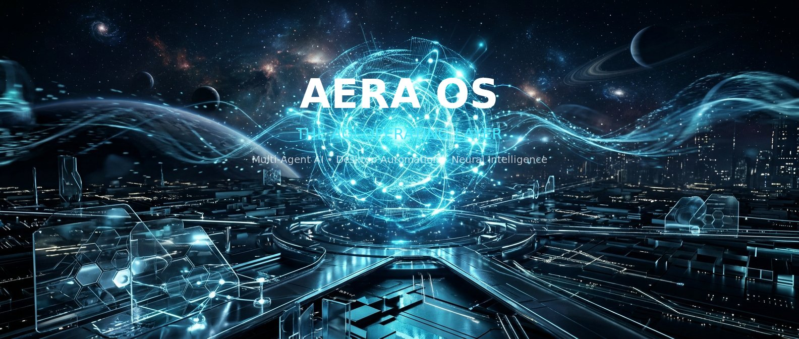

<!--
 ============================================================================
 AERA OS
 MADE By Manoj Dahal
 Copyright (c) 2026 Manoj Dahal
 ============================================================================
-->

# AERA OS



**Artificial Executive Reasoning Assistant - AGI Operating System**

AERA OS is not simply a desktop application. It is a Voice-First Artificial Intelligence Operating System. It functions as the intelligent operating layer between humans, computers, applications, devices, and knowledge. 

AERA listens, thinks, plans, executes, learns, and improves—always remaining completely transparent, privacy-first, and strictly under user control.

---

## ⚡ Core Architecture

AERA operates on a highly scalable, modular **Multi-Agent** backend running atop an **Electron / React / Node.js** stack. 

### The Execution Pipeline:
1. **Brain Resolution**: The raw voice string enters the `NeuralCore` and `UnderstandingAgent` to resolve multi-lingual code-switching and implicit pronouns based on historical `SynapticMemory`.
2. **Intent & Planning**: The `HeadAgent` routes the goal to the `PlannerEngine` (Groq/Llama-3), which decomposes the goal into a strict Directed Acyclic Graph (DAG) of JSON tasks.
3. **Execution**: The `ExecutionEngine` proxies tasks to **20+ Specialized Agents** (`DesktopAgent`, `BrowserAgent`, `VisionAgent`, `CodingAgent`, etc.).
4. **Verification**: The `VerifierEngine` (Anthropic Claude 3.5) checks the physical result of the workflow to prevent hallucinations.
5. **Memory & Response**: The `TeamworkOrchestrator` shares the context across the swarm, and the `VoiceAgent` generates a responsive, pitch-shifted audio stream.

---

## 🛠️ Stack & Technologies
* **Frontend**: React 19, TypeScript, Vite, Tailwind CSS, Framer Motion, Three.js (`react-force-graph-3d`)
* **Backend Shell**: Electron (Strict IPC Context Isolation), Node.js, `vm2` Sandboxing
* **Automation**: Playwright (Browser), Tesseract.js (Local OCR), native OS `exec` shells
* **Database**: Local SQLite / LibSQL, Drizzle ORM, Neural Graph DB
* **APIs**: Native HTTPS adapters for Groq (LPU), Google Gemini, and NVIDIA NIMs

---

## 🚀 Quick Start

Ensure you have Node.js (v18+) and Git installed.

```bash
# Clone the repository
git clone https://github.com/manoj-dahal/Aera-0S.git

# Navigate into the project
cd Aera-0S

# Install dependencies
npm install

# Set up local .env configuration (Add Groq/Anthropic keys if skipping mock simulation)
cp .env.example .env

# Build the Vite frontend payload
npm run build

# Launch the Electron Host
npm run electron:serve
```

---

## 🧠 System Viewports
The modern Glassmorphism UI gives users complete observability into the AGI pipeline:
* **`Holographic Core`**: The 3D reactive voice orb that pulses when AERA is thinking and executing (React Three Fiber).
* **`Workspace`**: A clean dashboard tracking active task workflows, memory utilization, and file ingestions.
* **`Memory Graph`**: An interactive 3D topology of local RAG vector embeddings.
* **`System Terminal`**: Raw `xterm.js` hardware-accelerated stdout from the Node orchestrator.
* **`Settings`**: A dynamic layout to update LLM routing rules, test API keys, and discover upcoming Foundation Models.

---

## 🛡️ Privacy & Security
AERA respects that the desktop is a highly privileged environment.
1. **Local Preferred**: RAG parsing, Vision OCR, and SQLite memory all happen completely offline on the host machine.
2. **Plugin Sandbox**: External plugins run strictly inside a `vm2` Node virtual machine wrapper. They cannot access local `fs` or `env` directly.
3. **Human In The Loop**: Sensitive OS file execution operations await explicit confirmation.

---

### License
MIT License. See `LICENSE` for more information.
